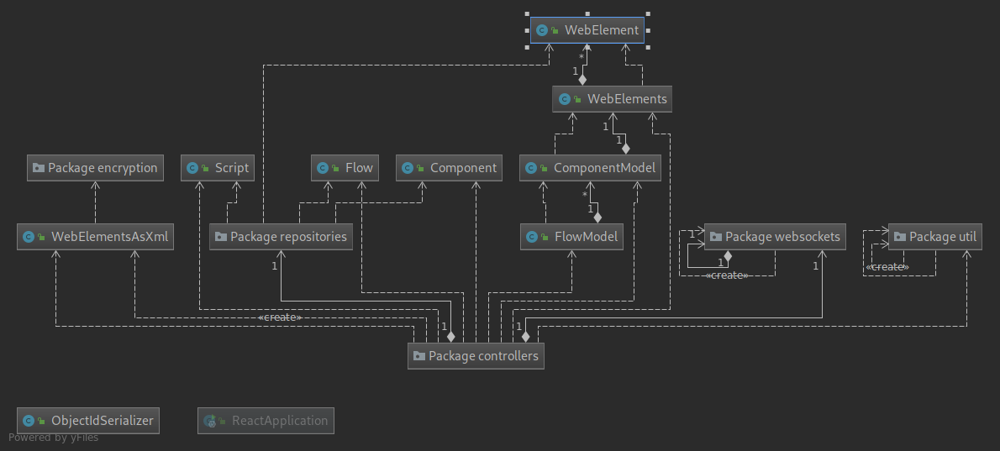
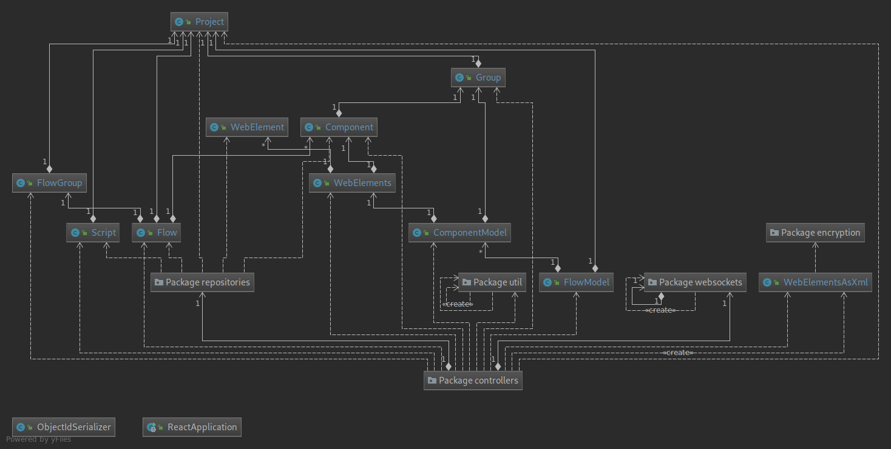

# Code Review

1. Critical errors in master branch. It was simple error, somebody rename method and forgot to rename all it usages. 
Anyway, I can't run program without code fixing. It shows, that developer didn't run code before commit and merge. 

1. [Bad software architecture](https://blog.cleancoder.com/uncle-bob/2012/08/13/the-clean-architecture.html). 
Architecture should be independent from database and framework. If in future system will migrate to another database, 
too much code should be rewritten. (Almost all controllers directly work with MongoDB. In any cases, use abstractions 
(repositories), but additionally directly communicate with mongoDB too). Many MongoDB aggregations hardcoded in controllers 
(sometimes with copy-paste). 

1. API Rest resource naming confusion. Part of endpoints used [convention of REST API](https://restfulapi.net/resource-naming), 
part developed hit or miss (For example, instead `/projects/script` used `/projects/script/create`. Or `projectscript` used 
to return all projects without script list, `/projects/groups/{groupId}` used to create new component). 
Endpoints make confused about data model's relations: `/projects/flow/addProject/{flowId}`. 

1. No any convenient type of response. I saw 3 type of responses: 
    - plain string with some JSON object. [link](plainStringResponse.json)
    - `TheResponseModel`, response template with two fields: `response` and `error`. [link](theResponseModel.json) 
    - `ResponseModel`, response template with four fields: `status`, `statusCode`, `message`, `data`. (Where `status` field 
already contains information of `status code`. And in nearly all cases `data` field is empty). [link](responseModel.json)  
It's good and worldwide used practice - always return status `200 OK` and if error, specify error field in response, but 
here 3 different options in use. And many cases when backend anyway return `500 Internal Server Error`. For example make request 
to `localhost:8080/projects/groups/123/` with body `{"name":"SomeTestName"}` and get [response](serverErrorResponse.json).

1. **ERROR** Developer used Optional class (new in Java 8), but he don't know how it works and how use it. 
Example, developer wrote next code `Optional<Flow> flow = flowRepository.findById(flowId);` Result variable always stores Optional object (it can contains flag empty result or not), but never be null. 
But developer later check it to null `if (flow == null)` (This statement in this context always will false. If fantastically this statement true, then return user `Flow with such id not found`) and later code crashes if there is no flow with specified identifier.  
In few places get value from optional without check `isPresent`, what generate exception. 

1. Sometimes backend requires too hard structures to make simple actions, for example to update component's name, 
we need to send request like `/projects/groups/components/{componentId}` with body: ```{"id":"1", "name":"newName", "groupId": "123", "active": false}```
only to update it's name. Instead we can send request like `/projects/groups/components/{componentId}?name=newName` with 
out any body and it will be more easier for computer and for person, who read code and develop. 

1. Absence of comments in code or [self documented code](https://en.wikipedia.org/wiki/Self-documenting_code).

1. Storing sensitive information in github (mongodb host). This information should be secret and don't store in source. It can be get from System variables for example.

1. Data models that fit business hard dependent on library. Every model uses as unique identifier ObjectId. It's good way to avoid collisions and key duplicates, but store identifiers as ObjectId is excess way and make software architecture more harder. It's easier to 
store identifiers as simple string. It will make code shorter, easier, no need to convert every time id to ObjectId, not to store excess information in mongo. But main problem of this approach is hard dependency on library.

1. All endpoints allow [CORS](https://en.wikipedia.org/wiki/Cross-origin_resource_sharing). Why? If it's just because we can, then this solution in [unsecured](https://en.wikipedia.org/wiki/Same-origin_policy). By default all CORS requests are deny.

1. Secret key for encryption hardcoded in sources and stored in repository. Secret key should be taken from secured storage. In case of emergency from system variables, but never be hardcoded.    

1. Mess in data models. `Flow` class uses as data model and `FlowModel` uses as Data Transfer Object. 

1. Backend should represents relations between data models, for easier work with all data flow. Software should know, that Project contains Groups, Scripts and Flows. But here only developer knows about this relations and builds hard aggregations to work with this data. 
Spring data provides tools to build models [cascading in MongoDB](https://www.baeldung.com/cascading-with-dbref-and-lifecycle-events-in-spring-data-mongodb).  

    
    Current model   

    
    Suggested model 

    Relations and code will be more easy to understand, support.

1. **POTENTIAL BUG** When client want to change activeness of component (`/projects/groups/components/{componentId}/{componentActiveness}`), backend makes all components inactive and then change clients component.

1. **POTENTIAL BUG** When client want to make all components inactive (`/projects/groups/components/make-all-inactive`), backend makes inactive only first component. 

1. **POTENTIAL BUG** When client want to get WebElements of component (`/projects/groups/components/{componentId}/web-elements`), backend returns only first web-elements of components. 

1. **POTENTIAL BUG and BUG** When client want to save component (`/xml-saver/save/{componentId}`) backend save to WebElementAsXml collection in Mongo only first web-element (POTENTIAL BUG). Then it tries to save this xml web-element 
in file in directory `./resources/XmlPages` and in case when this directory doesn't exists (I saw nowhere information, that i should create it), client received strange message like `"error": "./resources/XmlPages/Login.xml (No such file or directory)"`
What for this xml information saves not only in MongoDB, but also in file system? 

1. **BUG** In few places used syntax like project.toString() without overwriting toString method. It seems, that developer don't know [how work toString() method](https://www.geeksforgeeks.org/object-tostring-method-in-java/). By default it returns `getClass().getName()+"@"+Integer.toHexString(hashCode());`. So user receives from backend response `"response": "Optional[com.webcomponents.react.models.Project@7d75e015]"`.  

1. **POTENTIAL BUG** Maybe it's not a bug and fit business logic. When client want to `receiveWebExtensionData` and call endpoint `/web-elements` was implemented next logic: find first active component in database, remove from database all WebElements related to this component, set to WebElement from request this componentId and save new WebElement.

1. Some code catch exception and return it's message to client (FE for example). Why client should thing about java exception messages? (Example ComponentController.java `response.setError(io.getMessage());`)

1. Some endpoints has undefined params like Map<String, String> and then in code try to receive from this map structure specified 
parameter (`projectId` for example). I can be solver in more easier way, using simple Spring tools. (Write that end point receive 
`projectId` as request parameter like `url?projectId`). It will make code shorter, simpler, modern. And in case when project 
owner want to delegate FE part to another team, it will be easy to generate all API specification for a half an hour. 

1. Nearly 30 duplicates of code. It's hard to support and fix in future.
 
1. Commented code. It's very bad practice to have commented code in master (production ready branch). Where, without any explanation why it commented any and what for it here. 

1. Strange variable, method names, for example when user creates flow, variable for saved flow named `updatedFlow`. Why updated, if it was created? Or `getFlowDetailsByFlowId`, what receives ScriptId and returns Script. 

1. Uninformative responses to client, example `ResponseStatus.create("Issue to add component in flow", null, HttpStatus.NOT_FOUND, HttpStatus.NOT_FOUND.value());`. This response make more questions, which issue, why, why status Not Found, if really all found. This response sends when system can't save Flow with added component.

1. Debug information in STD_OUT like `System.out.println("come in componenet flow id........." + flowId);`, `System.out.println("kkkkkkkkkkkkkkkkkkkkkkkkkkkkkkkkkkkk" + ScriptId);`. It's maybe useful in development flow, to debug, but such code shouldn't be in master branch. 
Debug information may be in production, for monitoring how software work and watch potential errors, but it should be in general format and not in STD_OUT as plain text. 

1. In few places used Iterator to iterate through list of objects, but on first iteration it always return first object from this list. What for make code difficult using loop, when there is no need to loop. 

1. In some places object's data put into map structure to serialise it in JSON in response. Why not to serialise directly to JSON, if already there is dependency for that.

1. `ResponseModel` model for response and `ResponseStatus` class, that generates responses for few predefined cases (used seldom) placed in `util` package. 

1. In models fields and methods are shuffled, this make code hard to read. 

1. The absence of tests. But dependency for already installed. 

1. There are dependencies for WebJars and WebSockets, moreover there is simple web application embedded in backend with web-socket experiments. There is no place in master branch for not finished (not ready for production) experimental code. If someone wants to experiment and implements new feature like web sockets, he should checkout new branch, experiments there and only after finish all his work merge it in master. 

1. The absence of logs. Only not understandable, taken out of context lines like `kkkkkkkkkkkkkkkkkkkkkkkkkkkkkkkkkkkk5c9afa906fcf6d1c70866706`.

1. Every model has random access for its fields. But by convention, all field should be private. 


 